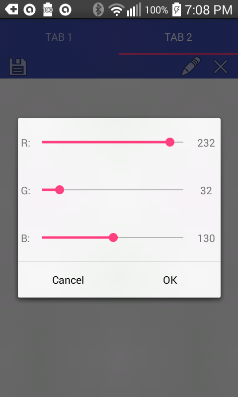
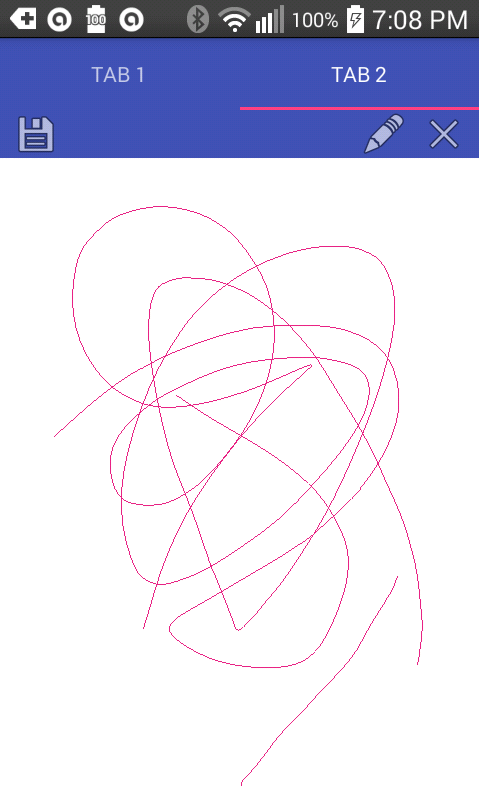

# Homework 1

Homework 1 is an Android application consisting of two small widgets:
  - Colors: A button that generates a random color and applies it to a text field.
  - Draw: A simple drawing canvas that can save images to the user's Pictures folder.
# Special Deployment Instructions

# How to Use
General:
- Switch between widgets by tapping the "Colors" and "Draw" tabs at the top of the screen.

Colors:

  - Tap the text box at the top to type any text.
  - Tap the large gray button to geenerate a random color.
  - The generated color is applied to the top text and its RGB values are displayed below the button.

Draw:

- Tap the pencil button to open a color picker dialog.
- Pick a color by moving the sliders.

- Drag across the screen to draw a line.

- Tap the X button to clear the screen.
- Tap the save button at the top left to save your picture to your device's Pictures directory.

# Design Methodology
I don't believe I put much thought into the design of the project. My intent was just to create a program that works as described in the assignment instructions.
### MainActivity Class
The main activity of my project consists of a ViewPager subclass, the tab bar that controls page selection, and the code that facillitates the interactions between the pager and the tab bar. It is based off of Android Studio's default "Tabbed Activity" class.
### DynamicallySwipeablePager Class
DynamicallySwipeablePager is the ViewPager subclass that I created for the main activity. It allows referencing objects to permit or forbid the user from switching tabs by swiping the screen to the sides. Swiping to switch tabs is disabled for the entire application.
### SubActivityColorRandomizer Class
All of the functionality required for Part 1 can be implemented in a single class. Creating this part was very simple. The only interaction is a single OnClickListener for the button. This listener is responsible for changing the text color and displaying the color values in the text below the button.
### SubActivityCanvas Class
The real meat of the project came in the form of designing the drawing canvas. This class contains the drawing canvas itself and the UX elements required to clear the canvas, pick the color, and save the picture. This class itself required two other classes - A class for the actual drawing canvas and a class for the color picker, which was implemented as a DialogFragment subclass. Picture saving functionality is split between this class and the drawing canvas class - this class creates the file and the drawing canvas writes to it.
### PaintingCanvasView Class
I'm going to openly admit that this subclass of View is based on the [Android Fingerpaint Example], but modified so that the class is separate from the activity. I modified it from the sample code as follows:
- Made the drawing paint into an encapsulated private variable of the class rather than a variable in the activity.
- Added a method to erase everything drawn on the canvas.
- Added a method to export the contents of the canvas as a .png to an output stream.
- Made the canvas fill itself with white when created, rather than leave it transparent.
### ColorPickerDialog Class
This color picker was not particularly difficult to implement. It was just several sliders, each assigned an instance of a listener that adjusts the appropriate color value for the particular slider. The slider values are set to the paint color values when the dialog is created, and confirming the dialog sets the paint color values.

   [Android Fingerpaint Example]: <https://android.googlesource.com/platform/development/+/master/samples/ApiDemos/src/com/example/android/apis/graphics/FingerPaint.java>
